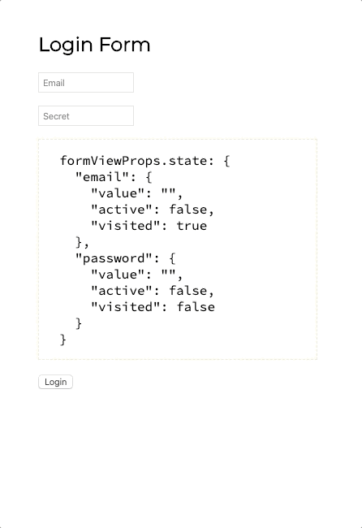

# Typed React Forms

[](https://github.com/semantic-release/semantic-release)

## Data Driven react forms

The way you deal with forms depends on the way you think about the data.
This library employs advanced `typescript` types to automatically generate forms even
from quite complex data structures (defined by `type` and `schema`).
You can now focus on data structures only.

Checkout simple login form example

```typescript jsx
import * as React from "react"
import { useFormHook, FormHookProps, FormView, InputRenderMap } from "typed-react-forms"

export type Credentials = { email: string; password: string }
type Props = Pick<FormHookProps<Credentials>, "initialValue" | "onSubmit">

const schema: FormSchema<Credentials> = {
    email: { type: "text", placeholder: "Email", validators: [] },
    password: { type: "password", placeholder: "Secret" }
}

export const LoginForm: React.FC<Props> = p => {
    const { formViewProps, onSubmitClick } = useFormHook({ ...p, schema })
    return (
        <>
            <h2>Login Form</h2>
            <FormView {...formViewProps} />
            <pre>formViewProps.state: {JSON.stringify(formViewProps.state, null, 2)}</pre>
            <button onClick={onSubmitClick}>Login</button>
        </>
    )
}

```




## the most wanted form features

### Custom renderers

```typescript jsx

export const CustomLoginForm: React.FC<Props> = p => {
    const { formViewProps, onSubmitClick } = useFormHook({ ...p, schema })
    const customRenderMap: Partial<InputRenderMap> = {
        text: p => <h1>Readonly {p.state.value}</h1>,
        password: p => <h2>Readonly {p.state.value}</h2>
    }
    return (
        <>
            <FormView {...formViewProps} customRenderMap={customRenderMap} />
            <button onClick={onSubmitClick}>Login</button>
        </>
    )
}
```

### Custom validators

### Collections support

### Typings

### Simplicity
