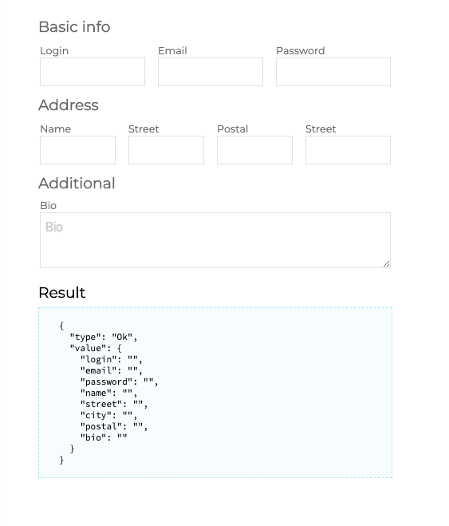
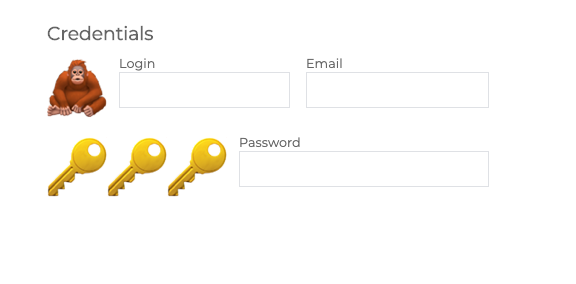
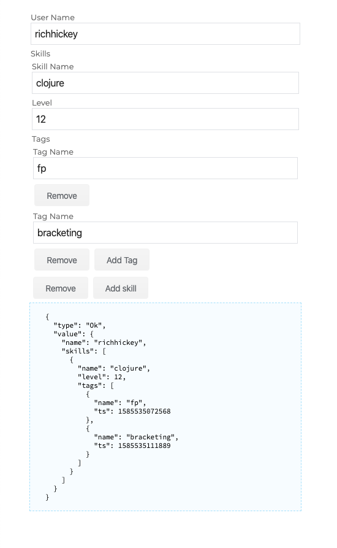

# Formless

<p align="center">
    
</p>
<p align="center">
	
	
</p>

## Data-driven react forms library written in typescript

The way you deal with forms depends on the way you think about the data.
This library employs advanced `typescript` types to automatically generate forms even
from quite complex data structures (defined by `type` and `schema`).
You can now focus on data structures only.

## Install

```sh
npm i @react-formless/core @react-formless/utils

```

## Example

Check out simple form example below, more complex one may be found in [examples folder](packages/examples/src) (online version may be found on [https://gmoskal.github.io/react-formless](https://gmoskal.github.io/react-formless))

```typescript tsx
import * as React from "react"
import { FormView, useFormHook, FormSchema } from "@react-formless/core"
import { validNumber } from "@react-formless/utils"

export type User = { name: string; password: string; age: number; bio: string }

const schema: FormSchema<User> = {
    name: { type: "text", placeholder: "Name ...", name: "Name", id: "name" },
    password: { type: "password", placeholder: "Password ...", name: "Password" },
    age: { type: "number", placeholder: "Age ...", name: "Age", validators: validNumber },
    bio: { type: "textarea", placeholder: "Bio...", name: "Biography" }
}

export const InputsForms: React.FC = () => {
    const { formViewProps: p, result } = useFormHook({ schema })
    return (
        <>
            <FormView {...p} />
            <h3>Result</h3>
            <pre>{JSON.stringify(result, null, 2)}</pre>
            <h3>State</h3>
            <pre>{JSON.stringify(p.state, null, 2)}</pre>
        </>
    )
}
```

it renders to


## Styled renderers

Whenever custom `shape` of the form is needed, an extended version of `<FormView>` component may be used. `<StyledFormView>` allows us to control the presentation layer of the form.
Check out the example:

```typescript tsx
import * as React from "react"
import { useFormHook, FormSchema, StyledFormSchema, StyledFormView } from "@react-formless/core"

type Address = { name: string; street: string; postal: string; city: string }
type User = Address & { login: string; email: string; password: string; bio: string }

const schema: FormSchema<User> = {
    login: { name: "Login", type: "text", id: "name" },
    email: { name: "Email", type: "text", readOnly: true },
    password: { name: "Password", type: "password" },
    name: { name: "Name", type: "text" },
    street: { name: "Street", type: "text" },
    city: { name: "Street", type: "text" },
    postal: { name: "Postal", type: "text" },
    bio: { name: "Bio", type: "textarea", placeholder: "Bio" }
}


export const styledSchema: StyledFormSchema<User> = [
    { type: "Title", value: "Basic info" },
    {
        type: "Row",
        value: ["login", "email", "password"]
    },
    { type: "Title", value: "Address" },
    { type: "Row", value: ["name", "street", "postal", "city"] },
    { type: "Title", value: "Additional" },
    "bio"
]

export const LayoutForm: React.FC = () => {
    const { formViewProps: p } = useFormHook({ schema })
    return <StyledFormView {...p} styledSchema={styledSchema} />
}
```

it renders to



Moreover whenever custom element is needed, we may use define `CustomFields` and pass `Custom` to `styledInputsRenderMap`

```typescript tsx

type User = { login: string; email: string; password: string }

const schema: FormSchema<User> = {
    login: { name: "Login", type: "text", id: "name" },
    email: { name: "Email", type: "text", readOnly: true },
    password: { name: "Password", type: "password" }
}

type CustomFields = { type: "emoji"; text: string; repeat?: number }

export const styledSchema: StyledFormSchema<User, CustomFields> = [
    { type: "Title", value: "Credentials" },
    {
        type: "Row",
        value: [{ type: "Custom", value: { type: "emoji", text: "🦧" } }, "login", "email"]
    },
    {
        type: "Row",
        value: [{ type: "Custom", value: { type: "emoji", text: "🔑", repeat: 3 } }, "password"]
    }
]

const Custom: React.FC<{ value: CustomFields }> = p => (
    <span style={{ fontSize: "60px", marginRight: "10px" }}>{p.value.text.repeat(p.value.repeat || 1)}</span>
)

export const LayoutForm: React.FC = () => {
    const { formViewProps } = useFormHook({ schema })
    return <StyledFormView {...formViewProps} styledSchema={styledSchema} styledInputsRenderMap={{ Custom }} />
}
```

it renders to



## Collections support

`Formless` comes with default collection support, so whenever you want to create nested collections and you still want it to be __strongly typed__ `formless` is a good match.
Check out the complex example where each `User` has collection of `Skills` and each skill has collection of `Tags`.

```typescript tsx
import * as React from "react"
import { FormView, useFormHook, toResult, FormSchema } from "@react-formless/core"

type User = { name: string; skills: Skill[] }
type Skill = { name: string; level: number; tags: Tag[] }
type Tag = { name: string; ts: number }

const skillSchema: FormSchema<Skill> = {
    name: { name: "Skill Name", type: "text" },
    level: { name: "Level", type: "number" },
    tags: {
        name: "Tags",
        type: "collection",
        mutate: { addNextLabel: "Add Tag", createValue: () => ({ name: "", ts: new Date().getTime() }) },
        fields: { name: { name: "Tag Name", type: "text" }, ts: { type: "hidden" } }
    }
}

const userSchema: FormSchema<User> = {
    name: { name: "User Name", type: "text" },
    skills: {
        name: "Skills",
        type: "collection",
        mutate: { addNextLabel: "Add skill", createValue: () => ({ name: "", level: 0, tags: [] }) },
        fields: skillSchema
    }
}

export const InputCollectionForm: React.FC = () => {
    const { formViewProps: p, result } = useFormHook({ schema: userSchema })
    return (
        <>
            <FormView {...p} />
            <pre>{JSON.stringify(result, null, 2)}</pre>
        </>
    )
}

```

it renders to



## Custom renderers

When it comes to rendering `Formless` supports render maps. `Render map` is an object that describes how each supported input type should be rendered.
The easiest example is like:

```typescript tsx

export const CustomInputsForms: React.FC = () => {
    const { formViewProps: p } = useFormHook({ schema })
    const customRenderMap: Partial<InputRenderMap> = {
        text: rp => <h1>Readonly text {rp.state.value}</h1>,
        password: rp => <h2>Readonly password {rp.state.value}</h2>
    }
    return  <FormView {...p} customRenderMap={customRenderMap} />
}
```

That will render each `text input` and `password input` as an readonly `<h1>` and `<h2>` tag.

Ant-design and react-95 rendering may be installed using (both are a bit rough)

```sh
npm i @react-formless/antd @react-formless/react95
```

Checkout more complex exmaples on [https://gmoskal.github.io/react-formless](https://gmoskal.github.io/react-formless) under `custom renderes` section.

## More examples

To compile and run project's examples, clone this repo and type

```bash
yarn
yarn build
yarn workspace @react-formless/examples start
```

example project should be running on http://localhost:1234

You may check running online version [here](https://gmoskal.github.io/react-formless)

More documentation comming soon

### Custom validators


### Typings

### Simplicity
